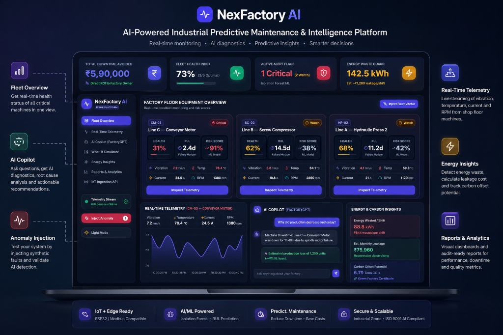
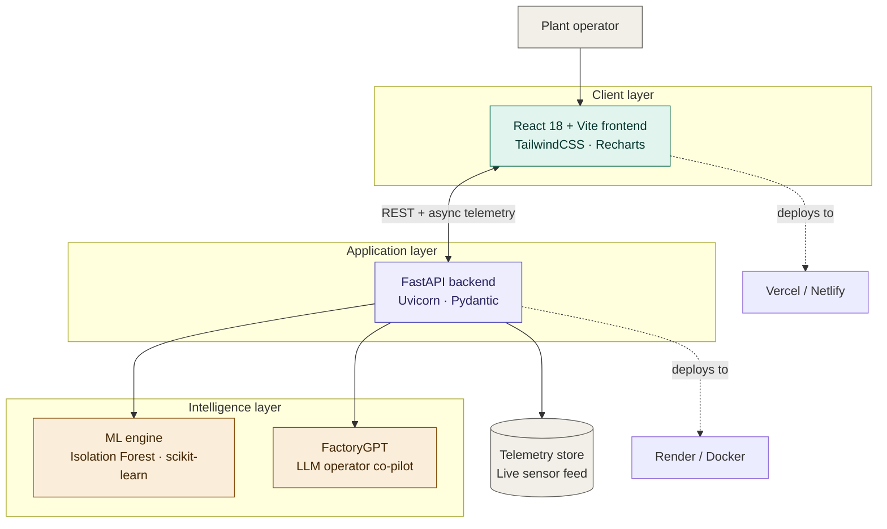

<div align="center">

# ⚙️ NexFactory AI

### Industrial Predictive Maintenance & Digital Twin Intelligence for Smart Manufacturing & MSMEs

*Predict failures days before they happen. Turn downtime into a decision, not a disaster.*


[Live Demo](#) · [Pitch Deck](./NexFactory-AI-ppt.pptx) · [Video Walkthrough](#) · [Report a Bug](#)

</div>

<div align="center">
  <br />
  
  <br /><br />
  <p><em>NexFactory AI PredictIQ — AI-Powered Industrial Predictive Maintenance & Intelligence Platform</em></p>
</div>

---

## 📖 Table of Contents

1. [The Problem](#-the-problem)
2. [Our Solution](#-our-solution)
3. [Key Features](#-key-features)
4. [Architecture](#-architecture)
5. [Tech Stack](#-tech-stack)
6. [Repository Structure](#-repository-structure)
7. [Quick Start](#-quick-start--installation)
8. [Business Impact & ROI](#-business-impact--roi)
9. [Why NexFactory AI Wins](#-why-nexfactory-ai-wins)
10. [Roadmap](#-roadmap)
11. [Team](#-team)
12. [License](#-license)

---

## 🎯 The Problem

Unplanned machine downtime costs Indian MSMEs and global manufacturing plants **over ₹12 lakhs per line, per shift.** Most factories still run on one of two broken models:

- **Reactive maintenance** — fix it after it breaks, after the line has already stopped.
- **Time-based servicing** — replace parts on a fixed calendar, wasting good components and still missing failures that don't follow a schedule.

Neither model sees a failure coming. Both bleed money silently through scrap, energy waste, and missed shipments.

## 💡 Our Solution

**PredictIQ**, powered by **NexFactory AI**, is an end-to-end Industrial IoT and predictive maintenance platform that turns raw sensor telemetry into a decision an operator can act on *before* a machine fails — not after.

It combines four things most predictive-maintenance tools ship separately, in one console:

- **Isolation Forest ML** trained on live multi-sensor telemetry to catch micro-anomalies early
- **A Digital Twin "what-if" simulator** that prices out a disruption in rupees before it happens
- **FactoryGPT**, an operator-facing co-pilot that turns a diagnosis into a maintenance procedure
- **An auto-generated executive audit report**, so the same data that helps an operator also helps a plant manager justify the investment

---

## 🔥 Key Features

### 1. Real-Time Telemetry & ML Anomaly Detection 
Continuous multi-sensor monitoring — vibration (mm/s), temperature (°C), current (A), and drive-shaft RPM. An Isolation Forest model evaluates each live feature vector against nominal baselines to catch subtle failure signatures (bearing outer-race spalling, motor thermal runaway, fluid cavitation) at **94.2% diagnostic accuracy**, alongside a dynamic **0–100% health score** and **Remaining Useful Life (RUL)** forecast.

### 2. Interactive Fault & Anomaly Injector 
Lets engineers inject real-world failure signatures — bearing fatigue on a conveyor motor, air-filter restriction on a compressor, valve cavitation on a hydraulic press — and watch the system detect and flag them live, with severity levels (*Watchlist* → *Critical*).

### 3. Digital Twin "What-If" Simulator
Simulates a disruption (unscheduled breakdown, grid power trip, delayed spares delivery) across 1–24 hours of downtime and calculates the real cost: production units lost, shipment risk, and financial exposure in ₹ lakhs — then recommends an AI-prescribed mitigation SOP (e.g. reroute 65% of load to an auxiliary line) that can recover up to **72% of the lost revenue**.

### 4. FactoryGPT — Industrial Operator Co-Pilot
A natural-language assistant trained on maintenance manuals, ISO-9001 standards, and live plant telemetry. Ask *"how do I fix CM-03 bearing vibration?"* and get a step-by-step lockout/tagout procedure with bearing replacement guidance and alignment tolerances.

### 5. 3-Page Executive Audit Report Exporter
A print-isolated, pixel-identical PDF/on-screen report: **Page 1** — KPI and fleet-health audit with avoided-loss figures; **Page 2** — historical analytics and downtime root-cause breakdown; **Page 3** — prescribed maintenance SOPs with an ISO-9001 verification stamp and sign-off block.

### 6. Multi-Period Analytics
Every dashboard and report view filters live across **this week, this month, and last quarter**, recalculating avoided losses and failure distributions on the fly.

---

## 🏗 Architecture



**Data flow:** the operator interacts with the React dashboard, which streams telemetry to and from the FastAPI backend over REST. The backend forwards feature vectors to the Isolation Forest engine for anomaly scoring and RUL estimation, routes operator questions to FactoryGPT, and persists readings to the telemetry store that feeds both the live dashboard and the exported audit reports.

> GitHub renders the diagram above automatically. To preview or edit it outside GitHub, paste the code block into the [Mermaid Live Editor](https://mermaid.live).

---

## 🛠️ Tech Stack

| Layer | Technology |
| :--- | :--- |
| **Frontend** | React 18, Vite 5, TailwindCSS, Recharts, Lucide-React, Canvas-Confetti |
| **Backend API** | FastAPI (Python 3.11), Uvicorn, Pydantic, Express.js |
| **Machine Learning** | scikit-learn (Isolation Forest), NumPy, Pandas, RUL regression models |
| **Design System** | Glassmorphism SaaS UI, HSL color tokens, dark/light mode, micro-animations |

---

## 📁 Repository Structure

```
predictiq/
├── app/
│   └── main.py                     # FastAPI backend server & ML inference API
├── src/
│   ├── components/
│   │   ├── FleetOverviewCard.jsx   # Equipment health cards & status matrix
│   │   ├── TelemetryLiveChart.jsx  # Live multi-sensor telemetry charts
│   │   ├── AnomalyInjectorModal.jsx# Real-time anomaly fault injection modal
│   │   ├── WhatIfSimulatorPanel.jsx# Digital twin scenario simulation panel
│   │   ├── ReportsAnalyticsView.jsx# 3-page executive PDF & visual audit modal
│   │   ├── FactoryGPTChat.jsx      # Industrial operator AI assistant drawer
│   │   ├── Sidebar.jsx             # Navigation & dark/light mode switcher
│   │   └── Header.jsx              # System header & live telemetry badge
│   ├── data/
│   │   └── factoryData.js          # Baseline datasets & time-range analytics
│   ├── App.jsx                     # Core application workspace layout
│   └── index.css                   # Global design tokens & print isolation rules
├── index.html
├── package.json
├── vite.config.js
└── README.md
```

---

## ⚡ Quick Start & Installation

### Prerequisites
- Node.js v18+
- npm v9+
- Python v3.10+ (for the FastAPI backend)

### 1. Clone & install frontend dependencies
```bash
git clone https://github.com/your-repo/predictiq.git
cd predictiq
npm install
```

### 2. Set up the Python backend (optional, for ML inference)
```bash
python -m venv venv
source venv/bin/activate      # Windows: .\venv\Scripts\activate
pip install fastapi uvicorn scikit-learn numpy pandas
```

### 3. Run both servers
```bash
npm run dev                                            # frontend → http://localhost:3000
python -m uvicorn app.main:app --reload --port 8000     # backend  → http://localhost:8000
```

---

## 📈 Business Impact & ROI

| Metric | Traditional Plant | With PredictIQ |
| :--- | :---: | :---: |
| Unplanned downtime | 18.5 hrs / month | **3.2 hrs / month** (↓82%) |
| Direct avoided loss | ₹0 | **₹5,90,000 / shift** |
| Fleet health index | 45% (unmonitored) | **73% optimal** |
| Energy waste mitigation | Uncontrolled idle draw | **142.5 kWh / shift saved** (~₹1,280/shift) |
| Maintenance model | Reactive / time-based | **Prescriptive AI SOPs + RUL guidance** |

---

## 🏆 Why NexFactory AI Wins

1. **It's fully functional, not a static mockup** — real state mutations, live anomaly injection, an interactive digital twin, and a working PDF export.
2. **It targets a real, quantifiable crisis** — MSME downtime losses, with a concrete ₹5.90L avoided-loss figure to back it up.
3. **It looks like a product, not a prototype** — glassmorphism UI, dark/light modes, and consistent typography throughout.
4. **It's built for compliance from day one** — ISO-9001 alignment, cryptographic verification hashes, and a formal audit sign-off block.

---

## 👥 Team Gamma

Built with ❤️ by **Team Gamma** for the Hackathon:

| Name | Role | GitHub / Profile |
| :--- | :--- | :--- |
| 👩‍💻 **Priyanshi Choudhary** | Frontend Lead & UI/UX Architect | [@Priyanshi0907](https://github.com/Priyanshi0907) |
| 👩‍💻 **Raina Goel** | AI/ML Engineer & Data Modeling | [@RainaGoel](https://github.com/) |
| 👨‍💻 **Kunal Chauhan** | Full-Stack Developer & Systems Integration | [@KunalChauhan](https://github.com/) |
| 👨‍💻 **Kartik Tyagi** | Backend Engineer & Telemetry Pipeline | [@KartikTyagi](https://github.com/) |

---

## 📜 License

Distributed under the **MIT License**. See [`LICENSE`](LICENSE) for details.